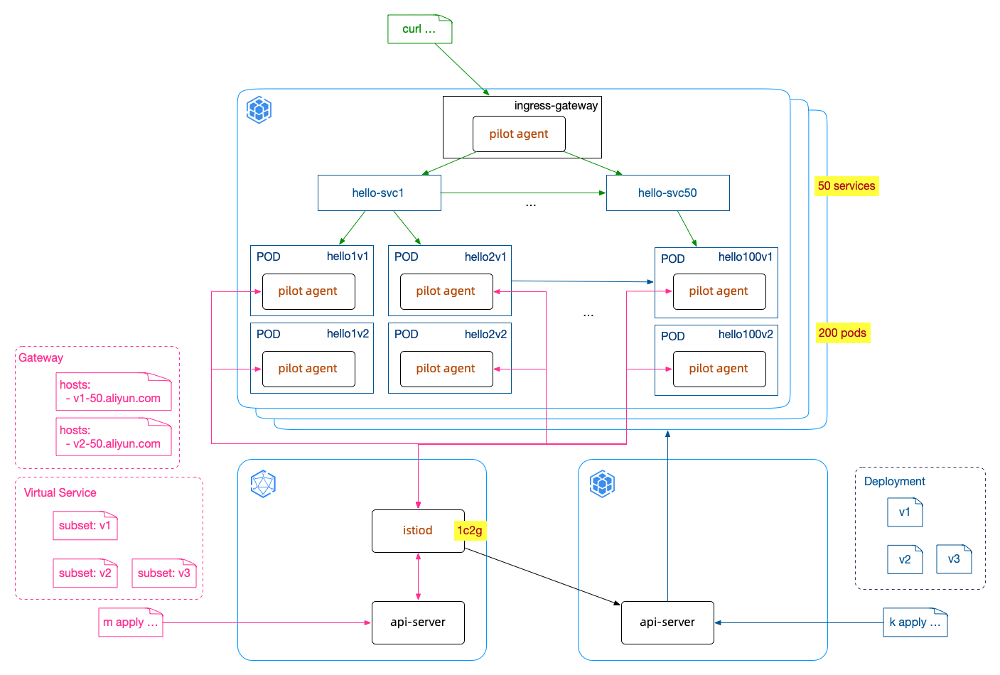

# ASM Performance/Stability Testing

## 

## 1 验证环境

- ACK版本：1.16.9-aliyun.1
- ASM版本：v1.7.5.3-gff686c62-aliyun

| 要素            | 说明                                                         |
| --------------- | ------------------------------------------------------------ |
| ACK资源         | 节点(8c64g)数4个总POD数256个(每节点POD数量上限64个) 可支配POD数约200个 |
| IngressGateway  | 开放8081端口                                                 |
| Service         | 50个命名规则：`hello-svc{n}` (n∈[1,50])链路规则：n<50 `hello-svc{n}`调用`hello-svc{n+1}` n=50 返回`hello {msg}@{svc}:{ip}` 代码：[http_springboot_demo](https://github.com/feuyeux/asm-best-practises/tree/master/http_springboot_demo) |
| POD             | 200个每个Deployment对应一个Service，`relicas: 2`同一时间存在：v1+v2 | v2+v3 | v3+v1命名规则：`hello{n}v{m}` (m∈[1,3],n∈[1,100])版本：v1/v2/v3镜像：registry.cn-beijing.aliyuncs.com/asm_repo/http_springboot_v1:1.0.0registry.cn-beijing.aliyuncs.com/asm_repo/http_springboot_v2:1.0.0registry.cn-beijing.aliyuncs.com/asm_repo/http_springboot_v3:1.0.0 |
| Gateway         | 50个(每个Gateway对应一个域名)命名规则：`hello-gw{n}` (n∈[1,50])域名命名规则：`v{m}-{n}.aliyun.com` (m∈[1,3],n∈[1,50]) |
| VirtualService  | 50个(每个VirtualService对应一个Gateway和一个Service)命名规则：`hello-vs{n}` (n∈[1,50])路由规则：将对`v{m}-{n}.aliyun.com`域名的请求，转向`hello-svc{n}`的`v{m}`版本 (m∈[1,3],n∈[1,50]) |
| DestinationRule | 50个(每个DestinationRule对应一个Service)命名规则：`hello-dr{n}` (n∈[1,50]) |

## 2 验证方法

### 2.1 初始化验证环境
- create 50 svc `v1_asm_perf.sh`
- create 100 pod_v1
- create 50 gw/vs/dr [v1]
- curl 验证链路 `curl_asm_perf.sh`

### 2.2 3组并行调用

- create 100 pod_v2 `v2_asm_perf.sh`
- update 50 gw/vs/dr [v1/v2]
- curl 验证链路

